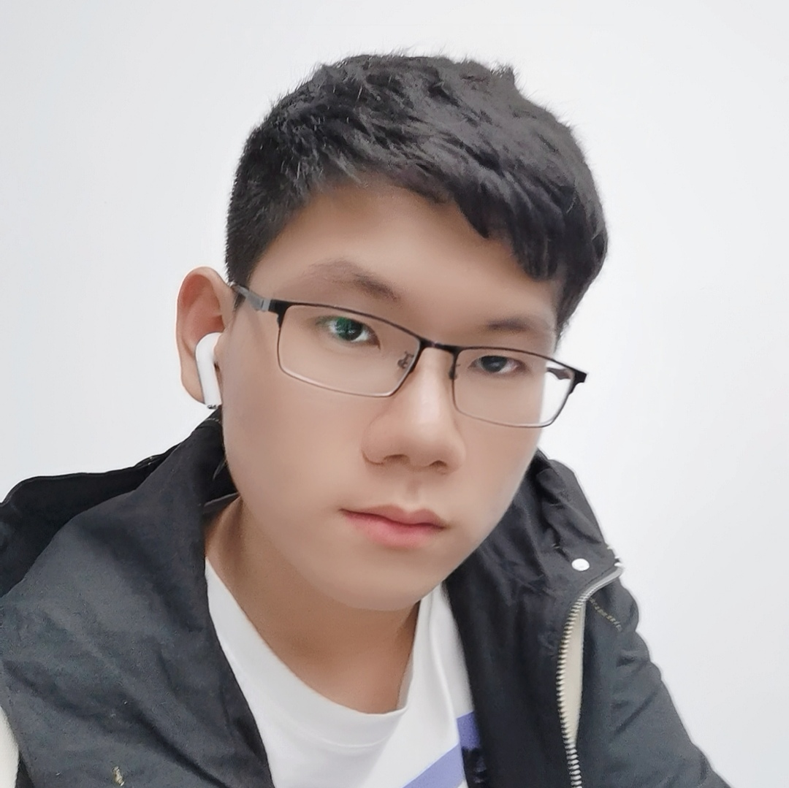

<html lang="en"><head>
    <meta charset="UTF-8">
    <title></title>
</head>
<body marginheight="0"><table border="0">
  <tbody><tr>
    <td width="75%">
      <h1>许轲</h1>
      
<b>本科生呢</b>

      
<b>浙江万里学院基础学院</b>

      
<b>邮箱：1477977237@qq.com</b>

      
<b>地址：宁波市鄞州区盛莫路浙江万里学院，6楼，邮编315100</b>

    </td>
    <td width="25%">
      
    </td>
  </tr>
</tbody></table></body></html>

个人特点

我喜欢动手，手艺不错，擅长使用电脑、机械、仪器或其它工具，视它们为得力的助手。

好奇心强，对事实敏感，能很好的利用手头的资源；不愿受规则约束，以独有的好奇心和富有创意的幽默观察和理解生活。

从小就立志要成为科学家或发明家，至今你依然酷爱钻研，好奇心旺盛，分析力强，坚持不懈，独立自信，不喜欢被约束但你能很好地自律，是积极的行动者。

优势：

能出色完成当前的任务，解决各种困难

敏锐的观察力和对事实、细节、信息的出色记忆力

能将混乱的数据和可辨认的事实有序排列

喜欢独立工作或与你敬佩的人并肩工作

对突然变化和迅速发生的转变适应良好，在面对危机时仍能保持头脑冷静

清楚地知道完成某个任务需要做什么和必须做什么

擅长用手和工具工作

具有丰富的常识，能有效利用资源

能屈能伸，愿意冒险，愿意尝试新事物

以下是我认为我最擅长的5项技能：

安装 ： 按照规范安装设备、机器、配线或程序

修理 ： 使用工具修理机器或系统

设备维护 ： 对设备、系统等进行定期维护，并确定保养和维修的方式和时间

工具选择 ： 确定某项工作中所需的工具或设备的种类

科学思维 ： 利用科学的规则和方法（比如对比、分类、演绎、归纳等）解决问题

大学四年的打算

多多参加有关高新科技的竞赛来丰富大学生活

希望能够收获到一只一支自己的团队来充实大学

